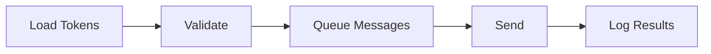

# Discord-Token-Spammer-3738

*A standalone Windows tool for admins and developers who need to push a large volume of Discord messages through multiple tokens to see how their own server, bot, or client actually holds up.*

## What this is

Discord-Token-Spammer-3738 is a desktop application built for one specific job: firing a controlled volume of messages through a batch of Discord account tokens so you can watch what happens next. Server owners use it to see how their rate-limit rules and moderation bots react under real load. Bot developers use it to check whether their anti-spam filters actually catch what they're designed to catch. It's not a botnet, a marketing tool, or a way to grow a server artificially — it's a stress-testing utility, and it's built and used that way.

The application ships as a single Windows executable. You load a list of tokens, point it at a channel or set of recipients, configure how fast and how often messages go out, and let it run. Everything happens locally on your machine — there's no cloud service reading your tokens, no telemetry phoning home, and no account required to use the tool itself. What you do with it, and where you point it, is entirely on you.

  

The button above opens the project's landing page, where the current Windows build is available to download.

## Who it is for

- **Discord server owners** who want to see how their rate-limits and automod actually behave under a burst of traffic, on servers they control.
- **Bot developers** validating that a spam-detection or moderation plugin fires the way it's supposed to.
- **QA testers** working on Discord-adjacent tools who need repeatable, high-volume message traffic for test cases.
- **Security-minded hobbyists** curious about how Discord's own rate limiting and token handling respond in practice.
- **New contributors** looking to get involved — the issue tracker keeps a running list of good-first-issues for anyone who wants to help improve the tool.

## What you can do

- **Load multiple tokens at once** from a plain text file, one per line
- **Send configurable message bursts** to a channel, DM, or group of targets
- **Randomize the delay** between sends so traffic doesn't look like a flat, mechanical loop
- **Auto-rotate tokens** when one gets rate-limited or flagged, without stopping the run
- **Customize message content** using simple placeholder variables for variation
- **Watch a live log panel** showing sends, failures, and the exact rate-limit responses coming back
- **Pause and resume a session** without losing your loaded token list or settings
- **Export a plain-text session report** afterward for review or record-keeping

## Getting started

1. Open the download page above and grab the current Windows build.
2. Extract the downloaded folder anywhere on your machine — there's no installer to run.
3. Launch `Discord-Token-Spammer-3738.exe`.
4. Paste in your token list and target details inside the app window.
5. Press start and follow the live log as messages go out.

That's the whole setup. No dependencies, no accounts to create, no configuration files to hand-edit before first launch.

## Requirements

- Windows 10 or 11 (64-bit)
- No Python, Node, or any other toolchain — it's a standalone `.exe`
- Around 50 MB of free disk space
- A working internet connection

## How it works

1. **Load** — your token list is read from the text file you provide.
2. **Validate** — each token is checked so dead or malformed entries don't waste a run.
3. **Queue** — messages are built from your template and lined up for sending.
4. **Send** — the app dispatches messages using the configured pacing and rotation rules.
5. **Log** — every result, success or failure, is written to the on-screen log and the session report.

## FAQ

**What is a Discord Token Spammer actually used for?**
Mainly load-testing and rate-limit verification — checking how a server, bot, or moderation setup responds when a lot of messages arrive in a short window, using a batch of tokens instead of one account.

**Is running something like this against Discord's Terms of Service?**
Discord's ToS restricts automated and abusive message sending on servers you don't own or control. This tool is meant for servers and bots you're personally responsible for testing — using it against accounts or communities that aren't yours can get tokens and servers banned.

**Will my tokens get flagged if I use this?**
Possibly, especially with aggressive send rates. Discord's own anti-abuse systems are designed to catch exactly this kind of traffic pattern, so expect rate limits and occasional token flags during heavier tests.

**Why do some of my tokens fail right away?**
Usually because the token is expired, was generated incorrectly, or belongs to an account that's already been actioned by Discord. The validation step in the app will flag these before a run starts.

**Does this run on macOS or Linux?**
Not currently — the build on the landing page is Windows-only (10/11, 64-bit).

## Troubleshooting

**Windows Defender or SmartScreen flags the executable.**
This is common for unsigned indie tools. Choose "More info → Run anyway" if you trust the source, or check the landing page for the latest signed build.

**Tokens show as invalid immediately.**
Double-check formatting — one token per line, no extra spaces or quotes. Expired or already-banned tokens will also fail validation instantly.

**Sending slows down or stops after a few minut